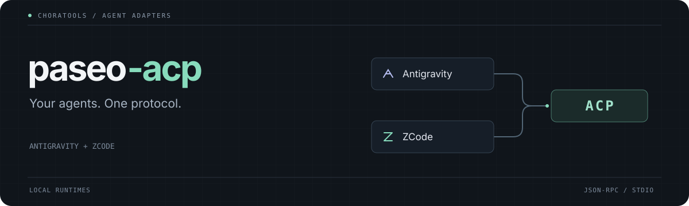

<p align="center">
  
</p>

<p align="center">
  <strong>Bring your Antigravity and ZCode agents to Paseo and other ACP clients.</strong><br>
  Local runtimes · Streaming responses · Zero production dependencies
</p>

<p align="center">
  <a href="#quick-start">Quick start</a> ·
  <a href="#adapters">Adapters</a> ·
  <a href="docs/configuration.md">Configuration</a> ·
  <a href="README.ko.md">한국어</a>
</p>

Two community adapters, one small package. Antigravity connects through its `agy` stream interface; ZCode connects through its native app server. Both expose [Agent Client Protocol](https://agentclientprotocol.com/) over stdio.

Your installed agent handles the model and tools. These adapters translate the conversation for your client.

## Quick start

### 1. Install your agent

You need **Node.js 22 or newer**, Git, and the official installation for each agent you want to connect:

- **Antigravity:** install [Google Antigravity](https://antigravity.google/) with the `agy` CLI available.
- **ZCode:** install [ZCode](https://zcode.z.ai/) and sign in to your account.
- **Paseo:** install [Paseo](https://github.com/getpaseo/paseo) if you want automatic client setup.

Vendor runtimes are discovered locally; they are not included in this repository.

### 2. Install the adapters

```sh
git clone https://github.com/choratools/paseo-acp.git
cd paseo-acp
npm install -g .
paseo-acp doctor
```

This installs from source. The package has not been published to the npm registry.

> **Using [Volta](https://volta.sh)?** Install a tarball instead of the folder. `npm install -g .` leaves a symlink that breaks when Volta moves the install into its tool store, so the commands fail with `Could not execute command` ([volta-cli/volta#2113](https://github.com/volta-cli/volta/issues/2113)):
>
> ```sh
> npm pack
> npm install -g ./choratools-paseo-acp-*.tgz
> ```

### 3. Connect to Paseo

```sh
paseo-acp setup --provider all
```

`all` connects both installed agents. For one agent, use `--provider antigravity` or `--provider zcode` with setup and doctor.

Setup adds `choratools-antigravity` and `choratools-zcode` provider entries, backs up your Paseo configuration, and preserves existing providers. Follow the printed reload instructions, then start a new agent with the corresponding provider in Paseo.

## Adapters

| | Antigravity | ZCode |
|---|---|---|
| Native interface | `agy` stream JSON | ZCode app server |
| Text and tool updates | Streaming | Streaming |
| Conversation state | Within the running session | Native persistent sessions |
| Load and list sessions | Not supported | Supported |
| Model selection | Native catalog when available; inherits `agy` default | Account-aware model catalog |
| Modes | Standard, Auto Edit, Plan | Build, Edit, Plan, Yolo |
| Client MCP servers | Not forwarded | Stdio, HTTP, SSE forwarded |
| Image and audio prompts | Not supported | Not supported |

**Antigravity** is a community bridge around `agy`. It is separate from Google's own Antigravity ACP integration. Cancelling a prompt or changing its runtime settings can restart the child process; history does not survive that restart.

Antigravity starts in **Plan** mode. Its terminal permission prompts are not bridged to ACP; see [execution settings](docs/configuration.md#antigravity-execution) before using unattended edits or commands.

**ZCode** keeps a native app-server connection and restores native session history. It exposes model and reasoning settings from the runtime, forwards permission decisions, and changes model selection per session.

### Start Plan and Trust Build

ZCode's catalog includes supported Individual Coding Plan and Start Plan models when your account has access. Start Plan access is checked against the official account balance; stored login data alone does not establish eligibility.

**ZCode Trust Build is a benefit attached to your plan, not a separate model.** It may appear as a benefit in a model description. Select the available **Start Plan** model to use that access. Models, activation times, and limits come from ZCode.

For Start Plan, sign in through the official ZCode desktop app first. The adapter uses the installation's existing account and device identity. It does not claim benefits or change your plan.

## Other ACP clients

Point a client that supports ACP over stdio at either command:

```sh
antigravity-acp
zcode-acp
```

The equivalent commands are `paseo-acp antigravity` and `paseo-acp zcode`. These are agent server processes: your client supplies the protocol messages.

For clients that accept a command and arguments, use:

```json
{
  "command": "paseo-acp",
  "args": ["zcode"]
}
```

Replace `zcode` with `antigravity` to switch agents. The surrounding configuration format depends on your client; the automatic setup command configures Paseo only.

## Account and configuration

```sh
paseo-acp login --provider zcode
paseo-acp doctor --provider zcode
```

ZCode login opens its native Coding Plan login flow. Start Plan uses the official desktop login. For Antigravity, sign in with the official app or run `agy` in an interactive terminal.

Custom installations can override runtime discovery. See [configuration and troubleshooting](docs/configuration.md) for paths, environment variables, backups, and removal.

## Compatibility

The adapters have been exercised against locally installed Linux runtimes. ZCode's structural session flows and a real Start Plan Flash response have been checked. macOS and Windows discovery paths are included but have not been verified on those systems.

ACP forwarding of MCP configuration does not establish connectivity to every MCP server. Compatibility also depends on the installed vendor runtime and the features your client supports. These adapters do not bypass account limits or provide an operating-system sandbox.

## Development

```sh
git clone https://github.com/choratools/paseo-acp.git
cd paseo-acp
node bin/paseo-acp.mjs doctor
```

The runtime adapters live in [`packages/`](packages/). Report reproducible issues through [GitHub Issues](https://github.com/choratools/paseo-acp/issues); include your Node version, OS, agent version, and redacted `doctor` output. Keep credentials and private conversation content out of reports.
